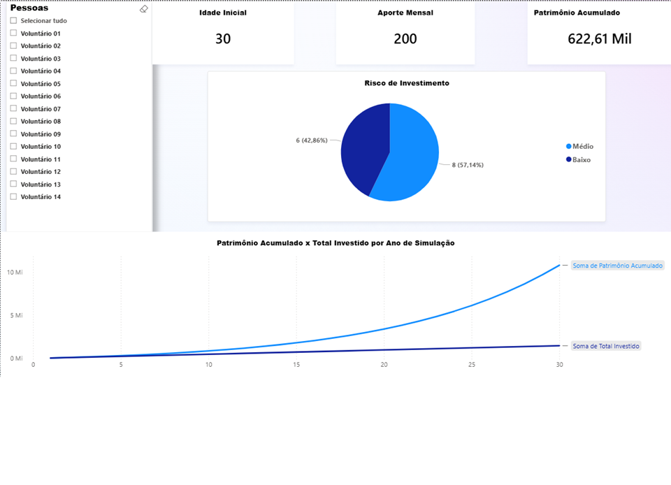

# 📊 Simulador de Previdência e Análise Comportamental (Geração 20+)

Um projeto completo de ponta a ponta (End-to-End) de Engenharia de Dados e Business Intelligence, desenvolvido para analisar o comportamento financeiro de jovens dos 20 aos 30 anos e projetar a evolução patrimonial baseada em juros compostos em um horizonte de 30 anos.

## Objetivo do Projeto
Demonstrar, através de dados reais coletados de 14 voluntários, como o tempo de investimento impacta mais a acumulação de patrimônio do que o valor inicial aportado. O sistema automatiza a captura de taxas, aplica regras de compliance e proteção de dados pessoais (LGPD), calcula a evolução ano a ano e apresenta os insights em um painel interativo de BI.

## Arquitetura e Tecnologias Utilizadas
* **Python**: Linguagem principal para automação, lógica de negócios e estruturação de dados.
* **Selenium WebDriver**: Automação web e Scraping para extração de catálogos e taxas de fundos de investimento.
* **Pandas**: Engenharia de Dados (ETL), limpeza de dados, mascaramento de identidade e formatação estruturada.
* **Power BI / Business Intelligence**: Visualização de dados executiva, modelagem temporal, KPIs de resumo e segmentação interativa.

##  Fluxo do Pipeline (ETL -> BI)
1. **Extração:** Leitura das respostas de formulário (`respostas_forms.xlsx`) e raspagem web em portal financeiro.
2. **Transformação:**
   * Tradução de faixas textuais de idade e renda para tipos numéricos processáveis.
   * Aplicação de lógica de mascaramento e padronização `Zero-Padding` (`Voluntário 01`, `Voluntário 02`...) em estrita conformidade com a LGPD.
   * Cálculo matemático iterativo de juros compostos para os 30 anos de cada indivíduo (gerando mais de 400 registros de série temporal).
3. **Carga:** Exportação automatizada da base consolidada (`base_para_powerbi.xlsx`) limpa, otimizada e sem linhas vazias.
4. **Visualização:** Dashboard interativo evidenciando o ponto de descolamento da curva de patrimônio sobre o total investido a partir do 15º ano.

## Principais Insights Descobertos
* **O Efeito Bola de Neve:** A partir do 15º ano de simulação, os juros passam a render mais dinheiro anualmente do que o próprio aporte que o voluntário tira do bolso.
* **Conservadorismo da Geração 20+:** 100% da amostra optou por perfis de segurança ou moderação (42,86% Baixo Risco e 57,14% Médio Risco), sem nenhuma incidência em fundos agressivos de renda variável.
* **O Custo da Espera:** A modelagem comprova que um jovem que começa aos 21 anos aportando quantias mínimas (ex: R$ 50,00) alcança um patrimônio final equivalente ou superior a quem começa aos 30 anos aportando valores consideravelmente maiores.
